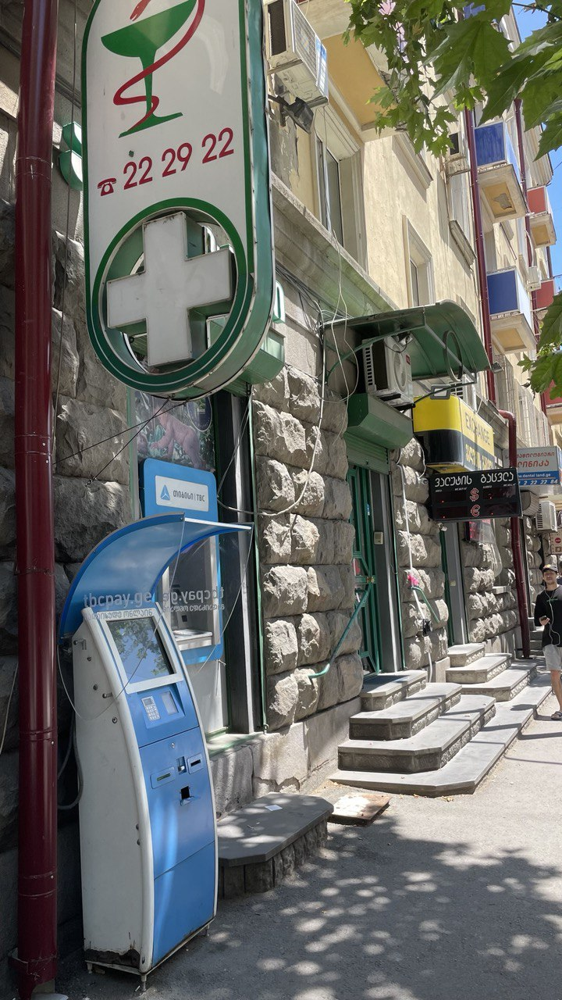

# Препараты доступные в Грузии

- Эстрогены
  - Дивигель
  - Фемостон
  - Прогинова
  - КОК (комбинированые оральные контрацептивы) на основе ЭЭ
- АА (анти андрогены)
  - Бикалутамид (в продаже найден только оригинал, Casodex 50мг)
  - Верошпирон

Все выше перечисленное продается в Грузии без рецепта

# Инъекционные препараты

В Грузии нет инъекционных эстрогено содержащих препаратов. Но есть инъекционный
прогестерон неизвестного качества (РФ производства).

Но из того что нам известно сейчас такие препараты легально (теоретически)
можно ввозить в Грузию, до **10!** упаковок. Так же теоретически такие
препараты можно заказывать онлайн из других стран доставкой почтовыми
отправлениями.

Фактически же информация хоть и имеет **относительные** подтверждения
безопасности ввоза и заказа, в том числе со стороны официальных
органов Грузии ([rs.ge](rs.ge)), практически мы не имеем успешных кейсов
доставки таких препаратов в Грузию, и не знаем о таких попытках в
целом. Хотя от определенных продавцов известно что у них есть клиенты
у Грузии которые успешно получают лекарства от них (какие именно
лекарства не известно, контактных данных покупателей продавцы
естественно не разглашают)

# Androcur/Андрокур

Есть два пути оффлайн и онлайн. Оффлайн дороже.

## Оффлайн

В Тбилиси есть пара аптект где он плюс минус стабильно есть, дозировки и цены уточняйте по факту

1. Name: "He first and two"  
    Adress: Lock Tbilisi Vake Vaki Park Tamarashvili St. 1 across the street from Vaki Park. Vake-Saburtalo Road Rientiri Beginning in Firni: Green "Afiaki" 2 202922;
   Working hours: 24/7;
   Phone: 032 2 222922;
   Говорят по русски, вроде можно заказать что то чего нет в наличии сейчас.
   
2. Name: "Emji" LLC: Tbilisi station, Surami st. 13 Address: intersection of Tamar Mefi and Surami Streets Street: Furnishi:  
   working hours: 24/7;
   Phone:
   032 2 951138,
   032 2 107172;

## Онлайн

pharmaco – ориентировочное время доставки 4-6 недель.

# Где заказать в Грузию?

Проверенные места:

- [pharmaco](https://pharmaco.ge/) – местный сервис который доставляет лекарства в Грузию из Турции и Европы.

  Из интересного на сайте можно найти эстрофем, андрокур (который тут не найти в аптеках), и mesigyna (иньекционный препарат этрадиола валерата и прогестина).
  Заказ тестовый на эстрофем приешл успешно. Но вместо расчетных 4-6 недель вышло где то 8-9, но я связываю это с тем что я заказывала как раз в момент около землетрясений, так что в нормальное время, сроки врятли так сильно нарушаться будут.

- [mediplus](https://www.mediplus.me/) – Отправляют из Испании, дошло до грузии за 2 недели, доходит в целом быстро, есть LENZETTO, еще есть пластыри с эстрадиолом и возможно что то еще, т.к. на сайте просто в каталоге не через поиск не найти ни LENZETTO, ни пластыри. Возможно могут достать что то чего нет на сайте, надо уточнять связываясь с ними.
